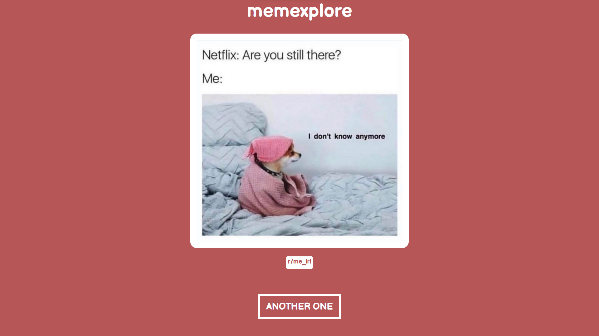

# memexplore

Simple meme-exploration App made with Vue.js 3 and axios.

Use by pressing the 'ANOTHER ONE'-button to get a meme shown from [this API](https://github.com/D3vd/Meme_Api).

Try and use it yourself [here](https://bucolic-shortbread-9a0211.netlify.app/). Mobile friendly too!

